> [!IMPORTANT]
>
> * ① winget 软件包管理器所管理的很多软件包可能会托管在 GitHub 上，因此需要你科学上网，否则可能会因为网络问题而导致软件包安装失败。
> * ② Win10 之后的很多系统内置软件，就是通过 winget 软件包管理器来进行安装的。


# 第一章：简介

## 1.1 Linux 中的软件包管理器

* 如果你玩过 Linux，一定对 Linux 中的软件包管理器并不陌生，如：`apt` 和 `dnf` 等，其主要目标是用来`解决依赖管理，简化软件包的安装`。

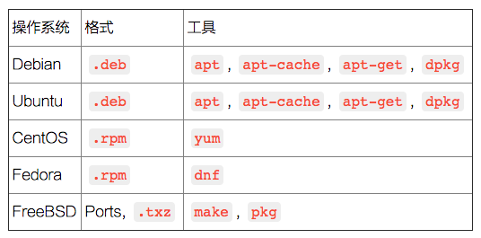

## 1.2 Windows 中的软件包管理器

* Windows 操作系统本身就是以`图形用户界面（GUI）`为主，早期大多数人都是通过鼠标下一步来安装软件包，Windows 上的软件包的格式通常是 `.exe`、`.msi` 以及 `.zip`，一旦软件包更新之后（新版本的推出），还需要用户重新下载并进行安装，以便体验最新的功能。

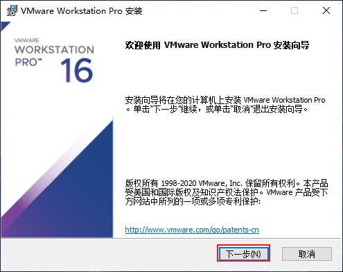

* 但是，随着时间的发展，Windows 社区吸收了 Linux 社区的思想，将软件包管理器也带入了 Windows 中，这样在 Windows 中我们也可以通过命令行来安装软件包。

> [!NOTE]
>
> * ① 软件包管理器是 Windows 的附加工具，用户可以选择使用，也可以直接通过网页或商店安装软件包。
> * ② 在 Windows 11、 Windows 10 1709（版本 16299）或更高版本上以及 Windows Server 2025 中，Windows 开箱支持 WinGet 程序包管理器。

* Linux 中的软件包管理器有多种，如：`dnf` 和 `apt` 等，Windows 也不例外，如下所示：
  * ① `winget（Windows Package Manager）`：Windows 官方支持，非常稳定。
  * ② `Chocolatey`：社区支持，但是维护的大量的软件包。
  * ③ `Scoop`：社区支持，主打轻量化。
  * ④ `Ninite`：一次性安装并更新所有程序（如果你不熟悉命令行，可以选择该工具）。

* WIndows 软件包管理器的特点，如下所示：

| Windows 软件包管理器 | 特点                                                         |
| -------------------- | ------------------------------------------------------------ |
| winget               | ① 官方提供，由微软开发。<br>② 命令行工具，可以快速安装、升级和卸载软件。<br>③ 包含常见的第三方软件包。 |
| Chocolatey           | ① 长期流行的第三方软件包管理器。<br>② 支持许多开发工具、服务和常见软件。<br/>③ 提供商业版支持。 |
| Scoop                | ① 专注于开发者工具，如：编程语言、数据库等。<br>② 无需管理员权限即可安装。<br>③ 使用简洁，易于扩展。 |
| Ninite               | ① 简单易用，适合普通用户。<br>② 自动化安装和更新常见软件，如：浏览器、媒体播放器等。 |

## 1.3 软件包管理器原理

* ① 用户通过`命令行`执行`命令`。
* ② `软件包管理器`去`远程仓库`下载对应的软件包并安装到本地计算机。


# 第二章：winget

## 2.1 概述

* 开发人员可以使用 `winget` 命令行工具发现、安装、升级、删除和配置特选应用程序集。 
* 安装后，开发人员可以通过 Windows 终端、PowerShell 或命令提示符访问 `winget`。

## 2.2 启用 tab 自动补全（仅限于 PowerShell ）

### 2.2.1 PowerShell 修改安全策略

* ① 使用 `win + x` 快捷键，选择 `Windows PowerShell（管理员）`：

::: code-group

```powershell 
win + x
```

```md:img [cmd 控制台]
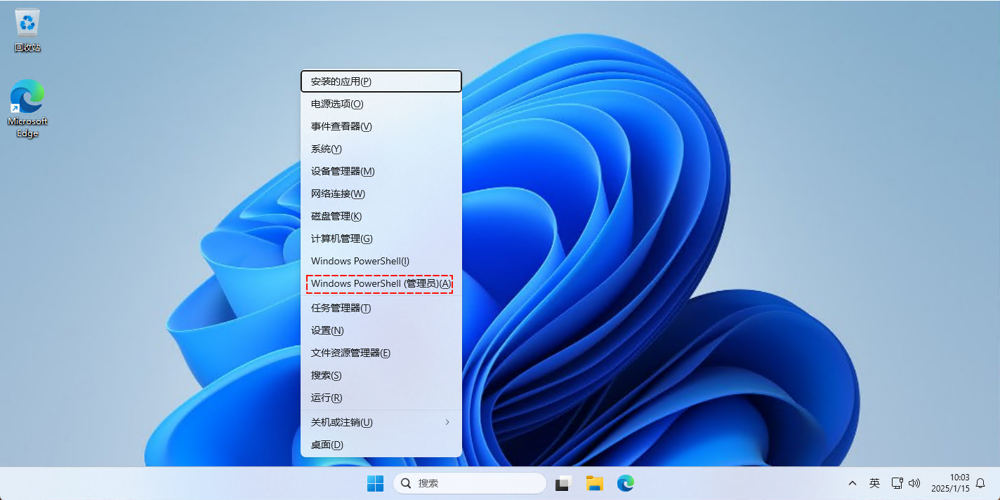
```

:::

* ② 修改安全策略：

::: code-group

```powershell 
Set-ExecutionPolicy -ExecutionPolicy RemoteSigned
```

```md:img [cmd 控制台]
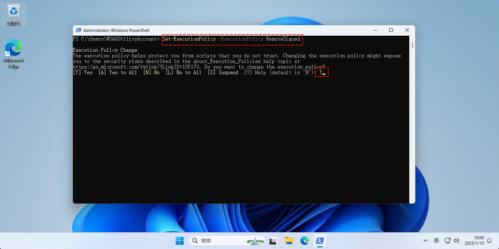
```

:::

* ③ 关闭终端，并重新打开：


### 2.2.2 启用 Tab 自动补全

* ① 打开 PowerShell ，并输入以下命令，在记事本中打开 `$PROFILE`：

::: code-group

```powershell 
notepad.exe $PROFILE
```

```md:img [cmd 控制台]
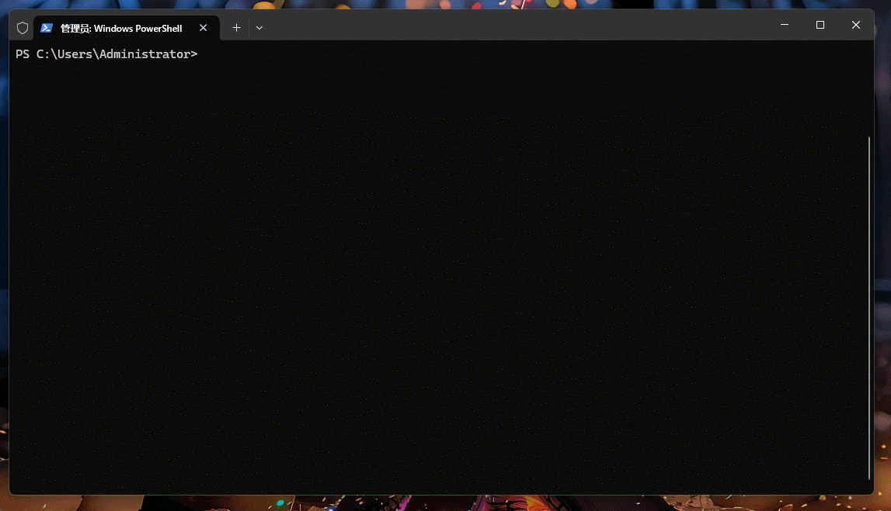
```

:::

* ② 将以下脚本复制并粘贴到已在记事本中打开的 `$PROFILE` 文件，保存并关闭 PowerShell ：

::: code-group

```powershell 
Register-ArgumentCompleter -Native -CommandName winget -ScriptBlock {
    param($wordToComplete, $commandAst, $cursorPosition)
        [Console]::InputEncoding = [Console]::OutputEncoding = $OutputEncoding = [System.Text.Utf8Encoding]::new()
        $Local:word = $wordToComplete.Replace('"', '""')
        $Local:ast = $commandAst.ToString().Replace('"', '""')
        winget complete --word="$Local:word" --commandline "$Local:ast" --position $cursorPosition | ForEach-Object {
            [System.Management.Automation.CompletionResult]::new($_, $_, 'ParameterValue', $_)
        }
}
```

```md:img [cmd 控制台]
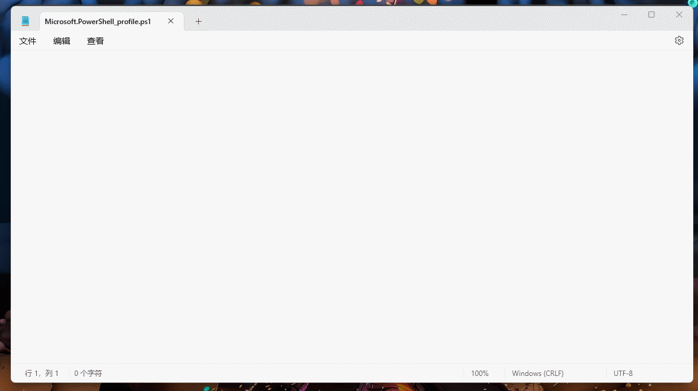
```

:::

* ③ 重新打开 PowerShell ，就会发现 `winget tab` 可以自动补全：

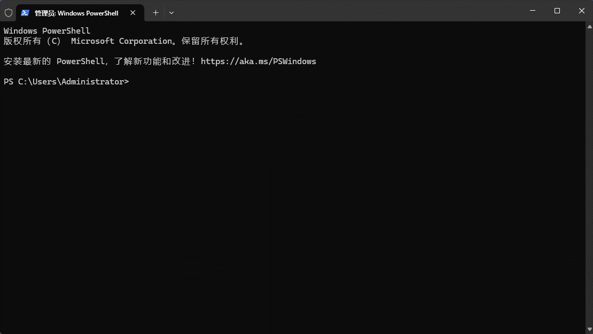

## 2.3 基本操作（CRUD，⭐）

### 2.3.1 搜索软件

* 命令：

```shell
winget search [可选参数] [-q] <软件名> 
```

> [!NOTE]
>
> 参数：
>
> * `-q、--query`：查询标志是用于搜索应用的默认参数。 无需指定。
>
> 可选参数：
>
> * `--id`：将搜索限制为应用程序的 ID。 该 ID 包含发布者和应用程序名称。
> * `--name`：将搜索限制为应用程序的名称。
> * `-s、--source`：使用指定的源名称（msstore 等）查找包。
> * `--versions`：显示程序包的可用版本。


* 示例：查询指定的软件包

::: code-group

```cmd [cmd 命令]
winget search nodejs
```

```md:img [cmd 控制台]

```

:::


* 示例：根据 id 查询指定的软件包

::: code-group

```cmd [cmd 命令]
winget search --id OpenJS.NodeJS
```

```md:img [cmd 控制台]
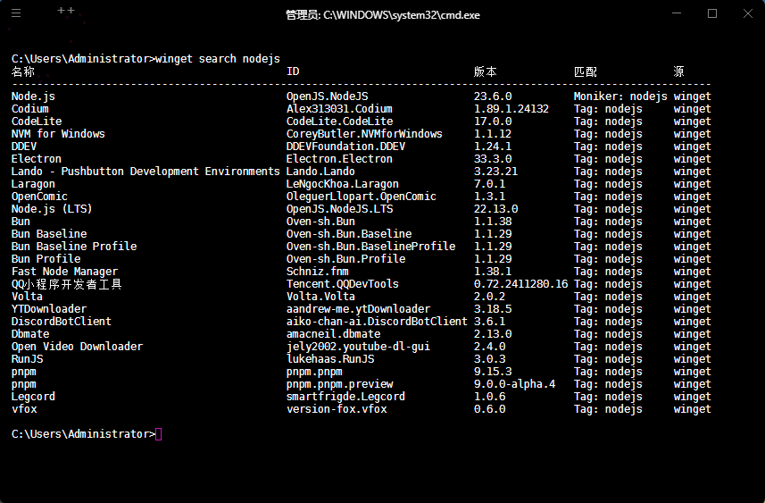
```

:::


* 示例：根据 name 查询指定的软件包

::: code-group

```cmd [cmd 命令]
winget search --name Node.js
```

```md:img [cmd 控制台]
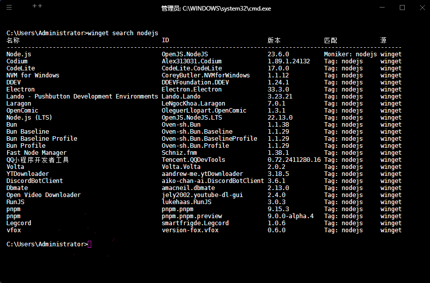
```

:::


* 示例：查询所有可用的软件包

::: code-group

```cmd [cmd 命令]
winget search -q ""
```

```md:img [cmd 控制台]

```

:::


* 示例：跨源搜索（结果范围缩小到特定源）

::: code-group

```cmd [cmd 命令]
winget search "Visual Studio Code" -s msstore
```

```md:img [cmd 控制台]
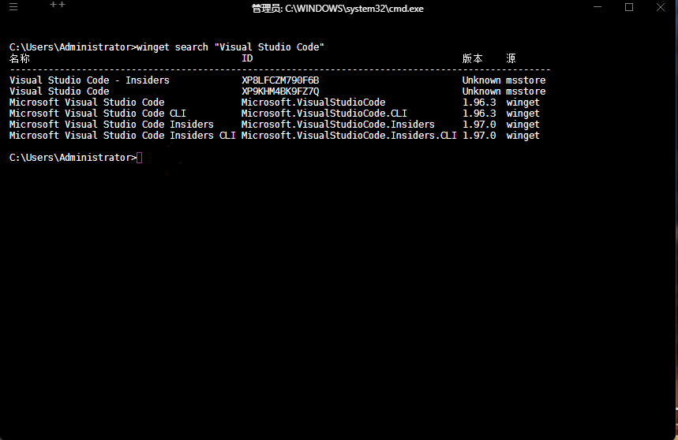
```

:::


* 示例：显示软件包的所有可用版本（软件包需要精确匹配）

::: code-group

```cmd [cmd 命令]
winget search --id Microsoft.PowerToys --versions
```

```md:img [cmd 控制台]
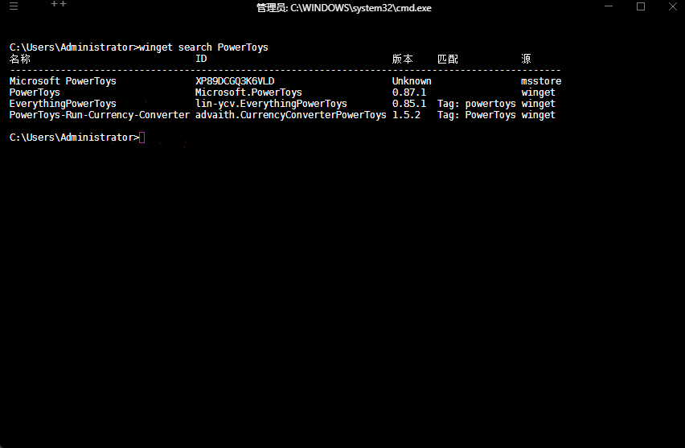
```

:::

### 2.3.2 安装软件

* 命令：

```shell
winget install [可选参数] [-q] <软件名> 
```

> [!NOTE]
>
> 参数：
>
> * `-q、--query`：查询标志是用于搜索应用的默认参数。 无需指定。
>
> 可选参数：
>
> * `--id`：将搜索限制为应用程序的 ID。 该 ID 包含发布者和应用程序名称。
> * `--name`：将搜索限制为应用程序的名称。
> * `-v、--version`：指定要安装的确切版本。 如果此项未指定，则使用 `latest` 会安装最高版本的应用程序。
> * `-s、--source`：使用指定的源名称（msstore 等）查找包。
> * `-l、--location`：指定需要安装到的位置（并非所有的软件都支持该参数），如果不指定，默认就安装到 `C:\Program Files\WindowsApps`目录中。


* 示例：安装 powertoys（需要精确匹配）

::: code-group

```cmd [cmd 命令]
winget install --id Microsoft.PowerToys
```

```md:img [cmd 控制台]
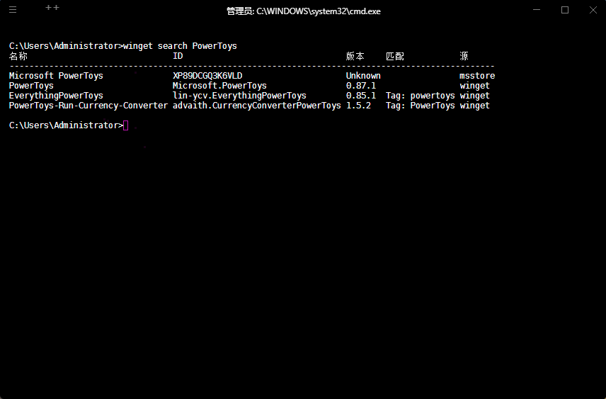
```

:::


* 示例：安装指定版本的 powertoys

::: code-group

```cmd [cmd 命令]
winget install --id Microsoft.PowerToys --version 0.17.0
```

```md:img [cmd 控制台]
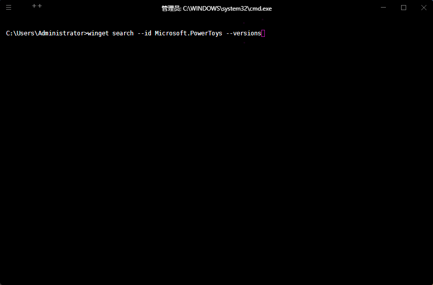
```

:::


* 示例：安装到指定位置

::: code-group

```cmd [cmd 命令]
winget install --id Apache.Groovy.4 -l D:\develop\groovy
```

```md:img [cmd 控制台]
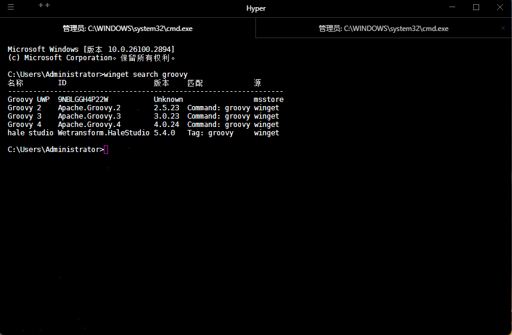
```

:::

### 2.3.3 升级软件

* 命令：

```shell
winget upgrade [可选参数] [-q] <软件名> 
```

> [!NOTE]
>
> 参数：
>
> * `-q、--query`：查询标志是用于搜索应用的默认参数。 无需指定。
>
> 可选参数：
>
> * `--id`：将搜索限制为应用程序的 ID。 该 ID 包含发布者和应用程序名称。
> * `--name`：将搜索限制为应用程序的名称。
> * `-v、--version`：指定要安装的确切版本。 如果此项未指定，则使用 `latest` 会安装最高版本的应用程序。


* 示例：更新指定软件包

::: code-group

```cmd [cmd 命令]
winget upgrade --id Apache.Groovy.4
```

```md:img [cmd 控制台]
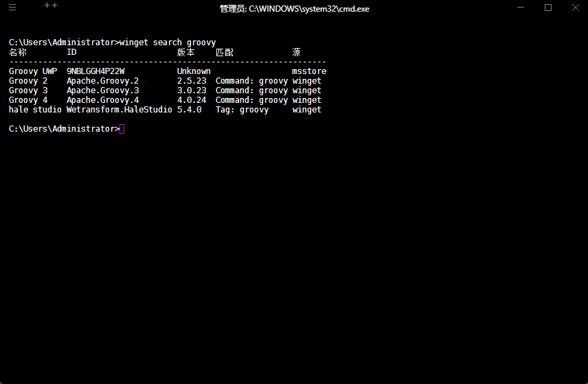
```

:::


* 示例：更新所有软件包

::: code-group

```cmd [cmd 命令]
winget upgrade --all --force --unknown
```

```md:img [cmd 控制台]
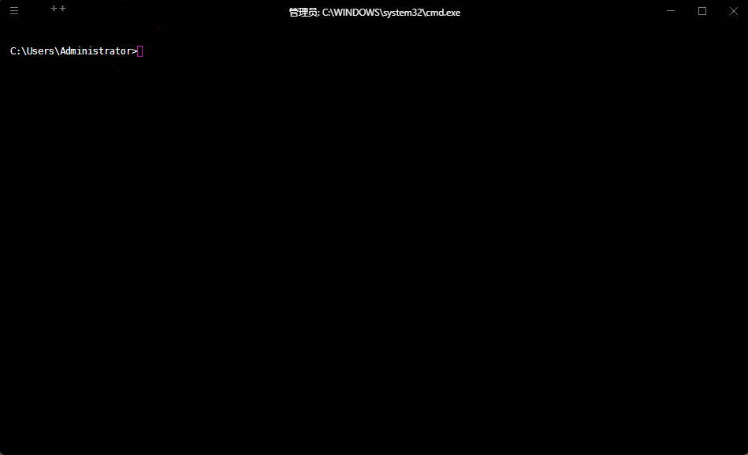
```

:::

### 2.3.4 查询本地已安装的软件

* 命令：

```shell
winget list  [可选参数] [-q] <软件名> 
```

> [!NOTE]
>
> 参数：
>
> * `-q、--query`：查询标志是用于搜索应用的默认参数。 无需指定。
>
> 可选参数：
>
> * `--id`：将搜索限制为应用程序的 ID。 该 ID 包含发布者和应用程序名称。
> * `--name`：将搜索限制为应用程序的名称。
> * `-n、--count`：限制查询中显示的应用个数。
> * `-s、--source`：使用指定的源名称（msstore 等）查找包。


* 示例：查询本地是否安装有 Git

::: code-group

```cmd [cmd 命令]
winget list git
```

```md:img [cmd 控制台]

```

:::


* 示例：查询本地安装的所有应用

::: code-group

```cmd [cmd 命令]
winget list
```

```md:img [cmd 控制台]

```

:::


* 示例：查询本地安装的所有应用，但是限制输出为 9 个

::: code-group

```cmd [cmd 命令]
winget list -n 9
```

```md:img [cmd 控制台]

```

:::


* 示例：查询本地安装有指定源的所有应用，但是限制输出为 9 个

::: code-group

```cmd [cmd 命令]
winget list --source winget -n 9
```

```md:img [cmd 控制台]

```

:::

### 2.3.5 卸载软件

* 命令：

```shell
winget uninstall [可选参数] [-q] <软件名> 
```

> [!NOTE]
>
> 参数：
>
> * `-q、--query`：查询标志是用于搜索应用的默认参数。 无需指定。
>
> 可选参数：
>
> * `--id`：将搜索限制为应用程序的 ID。 该 ID 包含发布者和应用程序名称。
> * `--name`：将搜索限制为应用程序的名称。
> * `-s、--source`：使用指定的源名称（msstore 等）查找包。


* 示例：卸载指定的软件

::: code-group

```cmd [cmd 命令]
winget uninstall --id Apache.Groovy.4
```

```md:img [cmd 控制台]
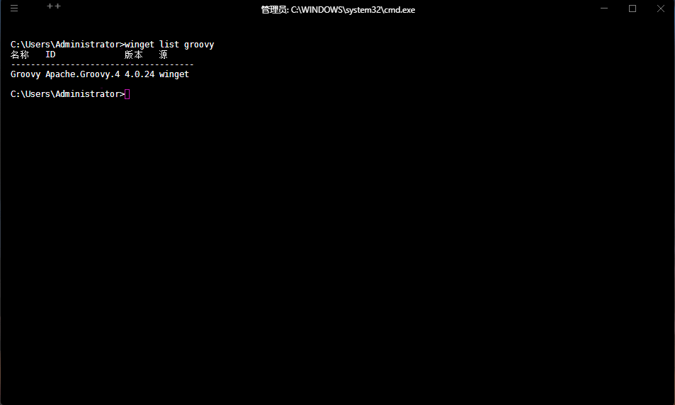
```

:::

## 2.4 winget 镜像源

### 2.4.1 概述

* 之前提过，软件包管理器是需要远程仓库（镜像源，存储库）来托管软件包，如下所示：


* 但是，默认情况下，winget 有些软件包是托管到 GitHub 上的，在国内如果使用 winget 进行软件包的下载会很慢，所以就需要切换到国内的 winget 的镜像源（存储库），如下所示：


### 2.4.2 查看 winget 镜像源

* 命令：

```shell
winget source list [-name 镜像源名称]
```

> [!NOTE]
>
> 默认情况下，winget 会配置两个镜像源，如下所示：
>
> * ① msstore ：Microsoft Store 目录。
> * ② winget ：Windows 程序包管理器应用镜像源。
>
> 可选参数：
>
> * `-name`：获取有关镜像源的完整详细信息。


* 示例：查询所有的镜像源

::: code-group

```cmd [cmd 命令]
winget source list
```

```md:img [cmd 控制台]
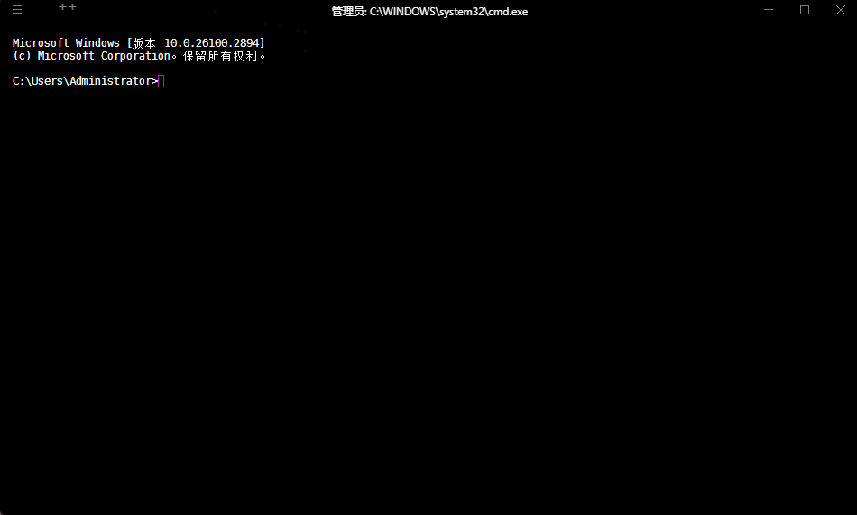
```

:::


* 示例：查询指定镜像源的详细信息

::: code-group

```cmd [cmd 命令]
winget source list --name winget
```

```md:img [cmd 控制台]

```

:::

### 2.4.3 添加 winget 镜像源

* 命令：

```shell
winget source add <镜像源名称> <镜像源的 URL 地址> --trust-level trusted
```

> [!CAUTION]
>
> 由于该命令会更改用户访问权限，因此使用 add 需要管理员权限。


* 示例：

::: code-group

```cmd [cmd 命令]
winget source add ustc https://mirrors.ustc.edu.cn/winget-source --trust-level trusted
```

```md:img [cmd 控制台]

```

:::

### 2.4.4 更新 winget 镜像源

* 命令：

```shell
winget source update [--name <镜像源名称>]
```


* 示例：更新所有镜像源

::: code-group

```cmd [cmd 命令]
winget source update
```

```md:img [cmd 控制台]
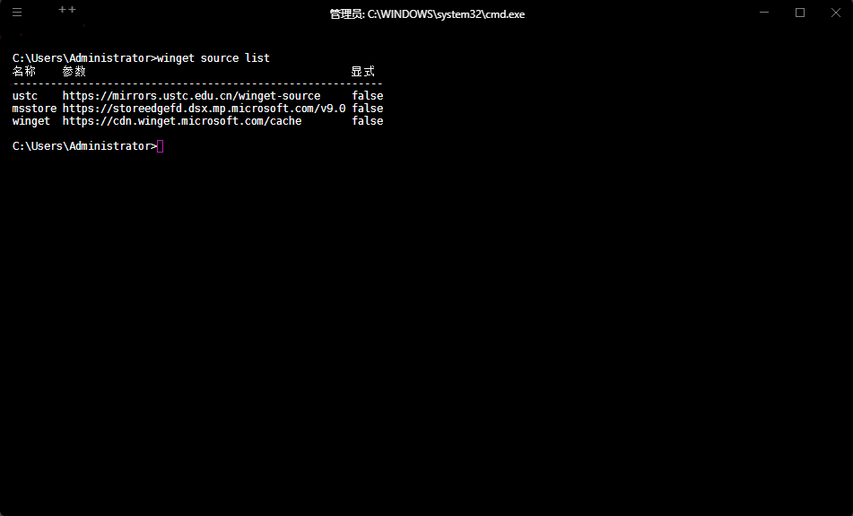
```

:::


* 示例：更新指定镜像源

::: code-group

```cmd [cmd 命令]
winget source update --name winget
```

```md:img [cmd 控制台]

```

:::

### 2.4.5 删除 winget 镜像源

* 命令：

```shell
winget source remove --name <镜像源名称>
```

> [!CAUTION]
>
> 由于该命令会更改用户访问权限，因此使用 remove 需要管理员权限。


* 示例：

::: code-group

```cmd [cmd 命令]
winget source remove --name winget
```

```md:img [cmd 控制台]
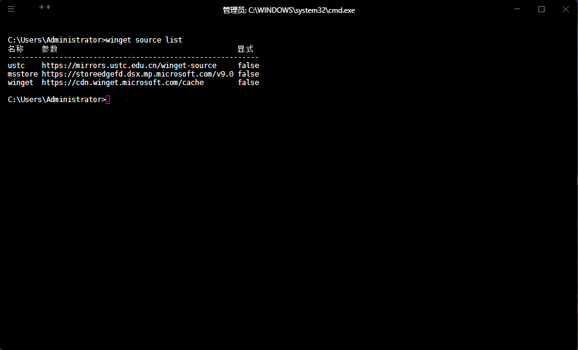
```

:::

### 2.4.6 重置 winget 镜像源

* 命令：

```shell
winget source reset --force
```

> [!CAUTION]
>
> * ① reset 子命令用于将客户端重置为其原始配置，并删除除默认源之外的所有源。 
> * ② 由于该命令会更改用户访问权限，因此使用 reset 需要管理员权限。


* 示例：

::: code-group

```cmd [cmd 命令]
winget source reset --force
```

```md:img [cmd 控制台]
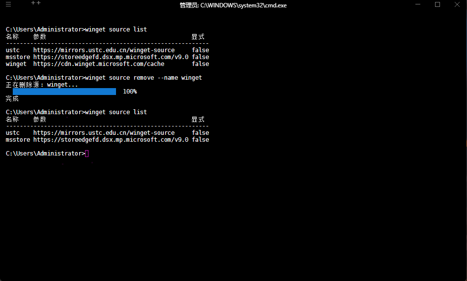
```

:::

## 2.5 其余命令

### 2.5.1 显示应用程序的详细信息

* 命令：

```shell
winget show [可选参数] [-q] <软件名> 
```

> [!NOTE]
>
> 参数：
>
> * `-q、--query`：查询标志是用于搜索应用的默认参数。 无需指定。
>
> 可选参数：
>
> * `--id`：将搜索限制为应用程序的 ID。 该 ID 包含发布者和应用程序名称。


* 示例：

::: code-group

```cmd [cmd 命令]
winget show --name Apache.Groovy.4
```

```md:img [cmd 控制台]
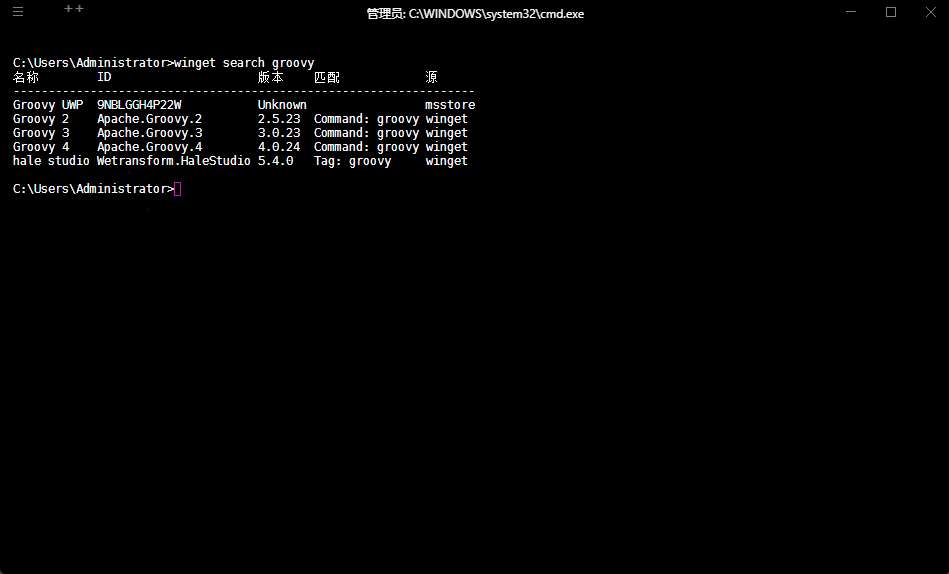
```

:::

### 2.5.2 应用程序的批量导出和批量导入

* 命令：

```shell
winget export [-o] xxx.json # 将应用程序的 JSON 文件导出到指定文件
```

```shell
winget import [-i] xxx.json # 导入要安装的应用的 JSON 文件
```

> [!NOTE]
>
> 应用场景：主要用于与其他开发人员共享该文件，或在还原开发、测试或生产环境。


* 示例：

::: code-group

```cmd [cmd 命令]
winget export -o package.json
```

```md:img [cmd 控制台]

```

:::


# 第三章：Chocolatey

## 3.1 概述

* Chocolatey 是长期流行的第三方软件包管理器，支持许多开发工具、服务和常见软件，其还提供商业版支持。

> [!NOTE]
>
> ::: details 点我查看 为什么还介绍 Chocolatey ？
>
> 因为有些软件还没有对 winget 进行适配，如：Maven 和 Gradle，如下所示：
>
> 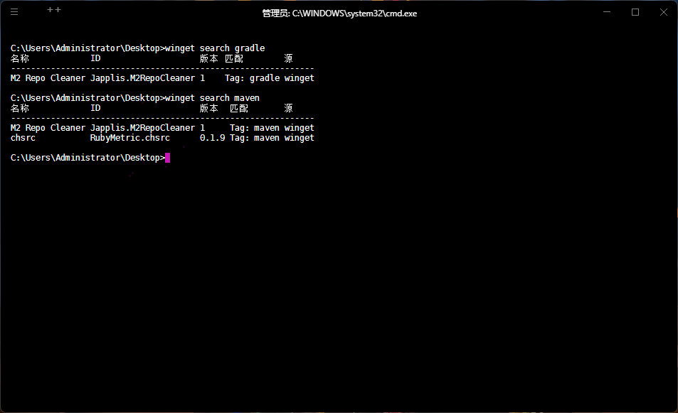
> :::

## 3.2 安装

### 3.2.1 winget 安装 Chocolatey（推荐） 

* 使用 winget 命令进行安装：

::: code-group

```cmd [cmd 命令]
winget install --id Chocolatey.Chocolatey
```

```md:img [cmd 控制台]
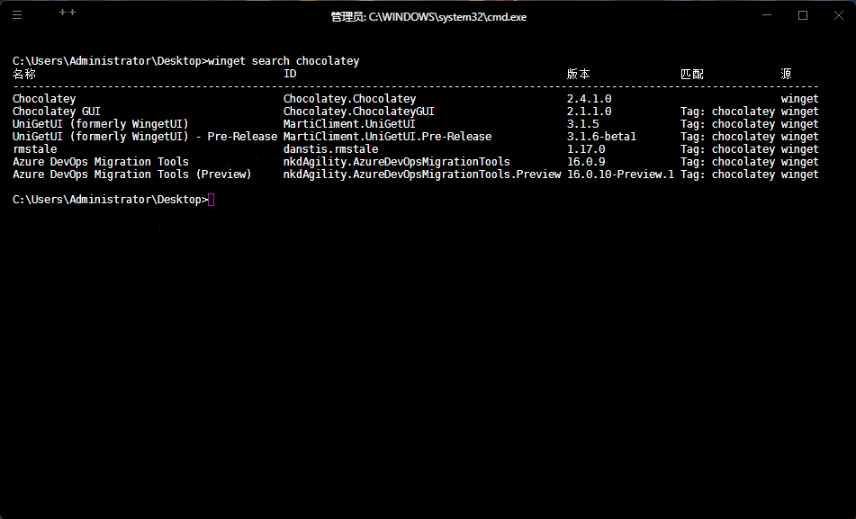
```

:::

### 3.2.2 手动执行命令安装 Chocolatey 

* 使用管理员的权限执行以下的命令：

::: code-group

```cmd
@"%SystemRoot%\System32\WindowsPowerShell\v1.0\powershell.exe" -NoProfile -InputFormat None -ExecutionPolicy Bypass -Command "[System.Net.ServicePointManager]::SecurityProtocol = 3072; iex ((New-Object System.Net.WebClient).DownloadString('https://community.chocolatey.org/install.ps1'))" && SET "PATH=%PATH%;%ALLUSERSPROFILE%\chocolatey\bin"
```

```powershell
Set-ExecutionPolicy Bypass -Scope Process -Force; [System.Net.ServicePointManager]::SecurityProtocol = [System.Net.ServicePointManager]::SecurityProtocol -bor 3072; iex ((New-Object System.Net.WebClient).DownloadString('https://community.chocolatey.org/install.ps1'))
```

```md:img [cmd 控制台]

```

:::

## 3.3 Chocolatey 远程仓库的使用

* 和 winget 不同的是，Chocolatey  提供了一个[可视化界面](https://community.chocolatey.org/packages)来辅助我们使用，如下所示：

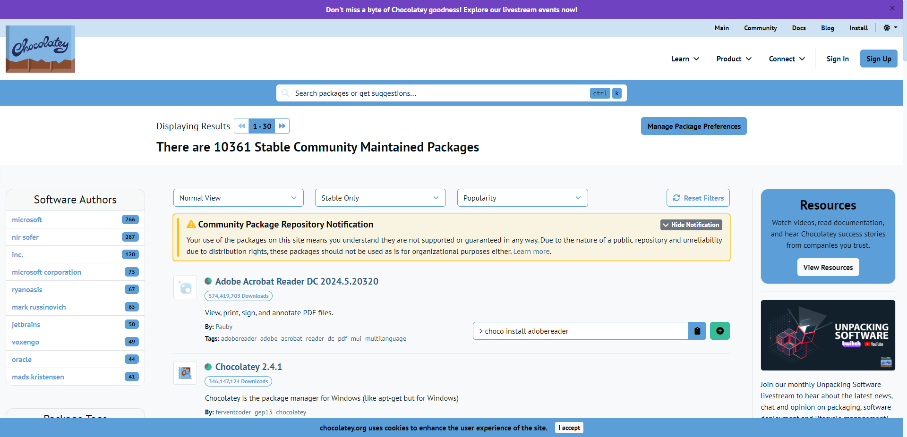

* 我们就可以在这个[可视化界面](https://community.chocolatey.org/packages)中搜索想要的软件包，获取软件包安装的命令，如下所示：

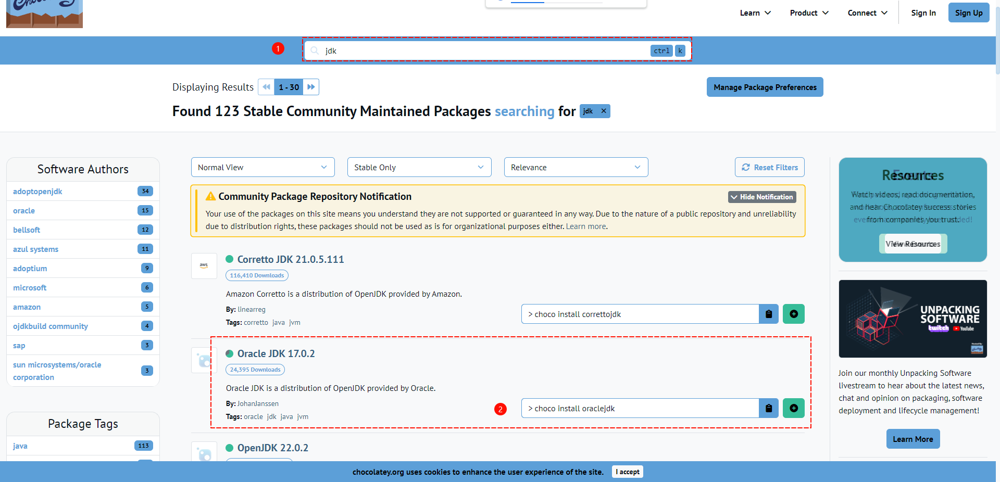

## 3.4 基本操作（CRUD，⭐）

### 3.4.1 搜索软件

* 命令：

```shell
choco search <软件名> [可选参数]
```

> [!NOTE]
>
> 可选参数：
>
> * `-y, --yes, --confirm`：确认所有提示。
> * `-s、--source`：使用指定的源名称（windowsfeatures、ruby、cygwin、python 等）查找包。
> * `-a, --all, --allversions, --all-versions`：显示程序包的可用版本。
> * `-e, --exact`：精确搜索。


* 示例：查询指定的软件包

::: code-group

```cmd [cmd 命令]
choco search nodejs
```

```md:img [cmd 控制台]

```

:::


* 示例：精确查找指定的软件包

::: code-group

```cmd [cmd 命令]
choco search nodejs --exact
```

```md:img [cmd 控制台]

```

:::


* 示例：查询所有可用的软件包

::: code-group

```cmd [cmd 命令]
choco search ""
```

```md:img [cmd 控制台]

```

:::


* 示例：分页搜索软件包

::: code-group

```cmd [cmd 命令]
choco search jdk --page=0 --page-size=25
```

```md:img [cmd 控制台]
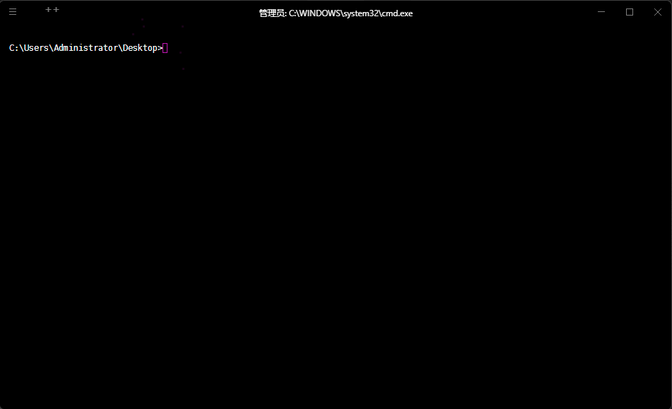
```

:::


* 示例：显示软件包的所有可用版本（软件包需要精确匹配）

::: code-group

```cmd [cmd 命令]
choco search 7zip --all-versions --exact
```

```md:img [cmd 控制台]

```

:::

### 3.4.2 安装软件

* 命令：

```shell
choco search <软件名> [可选参数]
```

> [!NOTE]
>
> 可选参数：
>
> * `-s、--source`：使用指定的源名称（windowsfeatures、ruby、cygwin、python 等）查找包。
> * `-f、--force`：强制安装，忽略已安装的相同版本。
> * `-d、--debug`：启用调试模式。
> * `-v、--verbose`：启用详细输出（verbose logging）。
> * `-y, --yes, --confirm`：确认所有提示。
> * `--params=""`：传递给软件包的参数。
> * `--install-arguments=""`：安装参数，直接传递给程序。


* 示例：安装 git 软件包

::: code-group

```cmd [cmd 命令]
choco install git
```

```md:img [cmd 控制台]

```

:::


* 示例：一次性安装多个软件包，并确认所有提示

::: code-group

```cmd [cmd 命令]
choco install notepadplusplus googlechrome 7zip -y
```

```md:img [cmd 控制台]

```

:::


* 示例：强制重新安装软件，并强制重新安装其依赖项

::: code-group

```cmd [cmd 命令]
choco install notepadplusplus --force --force-dependencies
```

```md:img [cmd 控制台]
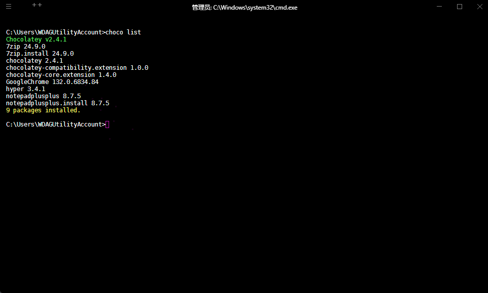
```

:::


* 示例：安装多个软件包，启用详细输出并强制安装

::: code-group

```cmd [cmd 命令]
choco install notepadplusplus googlechrome 7zip -dvfy
```

```md:img [cmd 控制台]
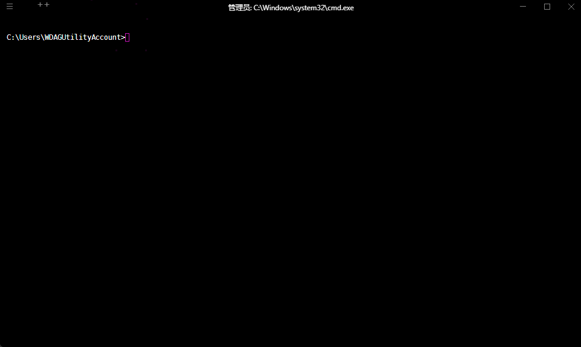
```

:::


* 示例：安装 Git ，并传递参数给 Git 

::: code-group

```cmd [cmd 命令]
choco install git -y --params="'/GitAndUnixToolsOnPath'"
```

```md:img [cmd 控制台]
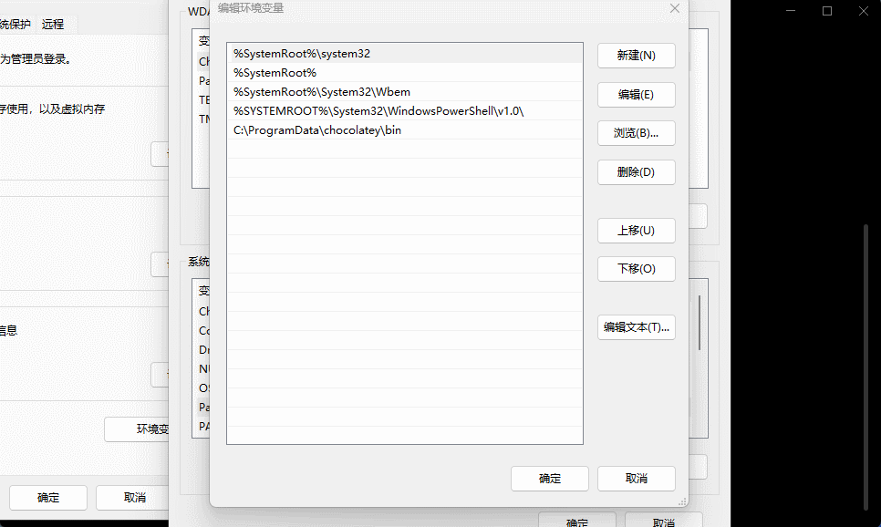
```

:::


* 示例：安装 Git ，指定额外的安装参数

::: code-group

```cmd [cmd 命令]
choco install git -y --params="'/GitAndUnixToolsOnPath'" --install-arguments="'/DIR=C:\git'"
```

```md:img [cmd 控制台]
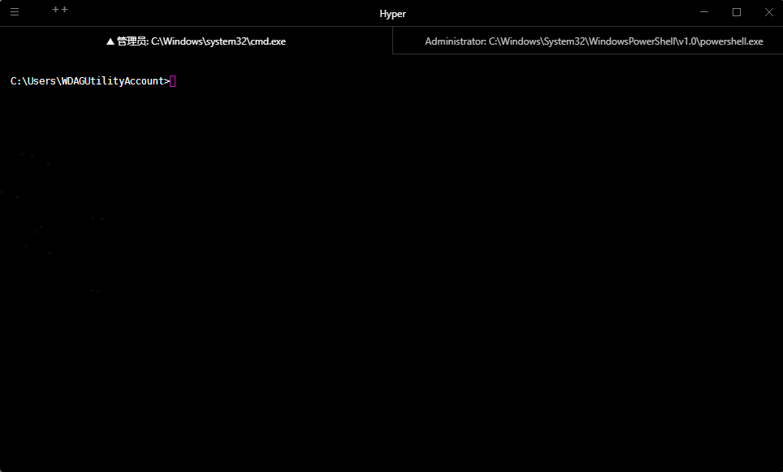
```

:::


* 示例：安装指定版本的 Node.js

::: code-group

```cmd [cmd 命令]
choco install nodejs --version 22.2.0
```

```md:img [cmd 控制台]
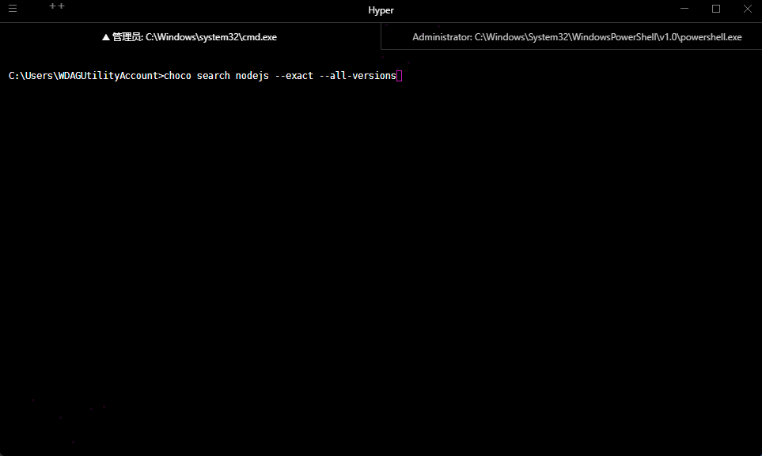
```

:::

### 3.4.3 升级软件

* 命令：

```shell
choco upgrade <软件名> [可选参数]
```

> [!NOTE]
>
> 可选参数：
>
> * `-s、--source`：使用指定的源名称（windowsfeatures、ruby、cygwin、python 等）查找包。
> * `-f、--force`：强制安装，忽略已安装的相同版本。
> * `-d、--debug`：启用调试模式。
> * `-v、--verbose`：启用详细输出（verbose logging）。
> * `-y, --yes, --confirm`：确认所有提示。
> * `--params=""`：传递给软件包的参数。
> * `--install-arguments=""`：安装参数，直接传递给程序。
>
> 准备工作：
>
> ```cmd
> choco install notepadplusplus --version 8.6.5 -fy --force-dependencies
> choco install git --version 2.41.0 -fy --force-dependencies
> choco install nodejs --version 22.2.0 -fy --force-dependencies
> ```


* 示例：更新 chocolatey

::: code-group

```cmd [cmd 命令]
choco upgrade chocolatey
```

```md:img [cmd 控制台]

```

:::


* 示例：批量更新多个软件包

::: code-group

```cmd [cmd 命令]
choco upgrade notepadplusplus
```

```md:img [cmd 控制台]
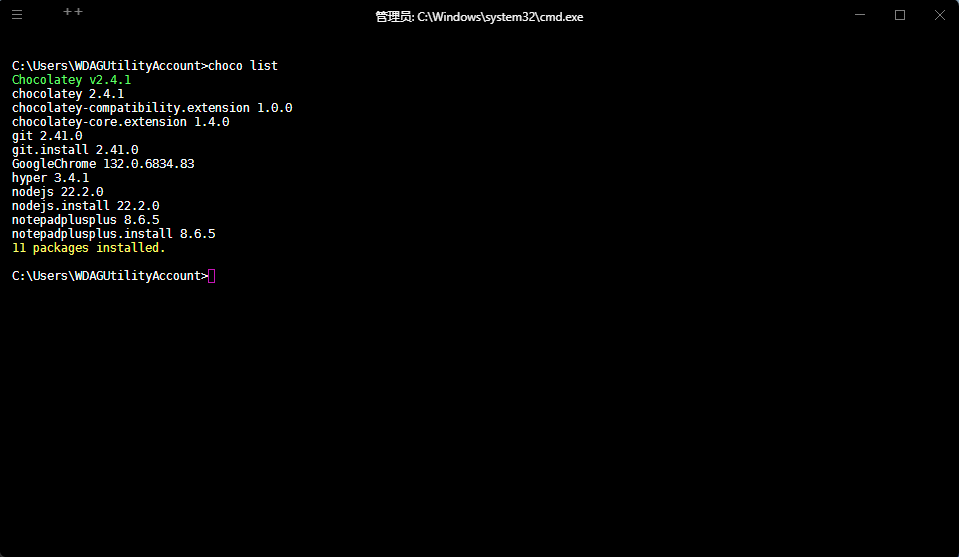
```

:::


* 示例：批量更新多个软件包，启用详细输出并强制安装

::: code-group

```cmd [cmd 命令]
choco upgrade notepadplusplus  -dvfy
```

```md:img [cmd 控制台]
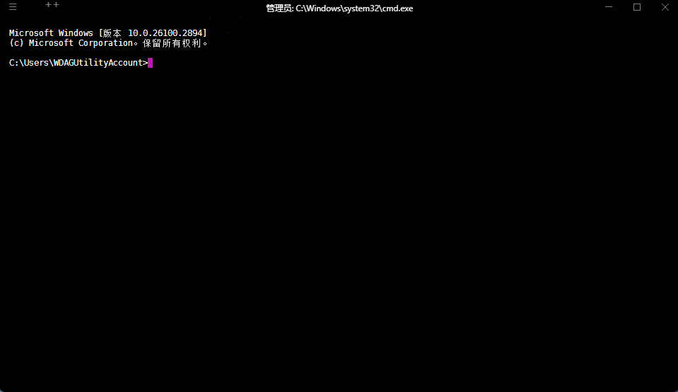
```

:::


* 示例：更新软件包，并传递参数

::: code-group

```cmd [cmd 命令]
choco upgrade git -y --params="'/GitAndUnixToolsOnPath /NoAutoCrlf'"
```

```md:img [cmd 控制台]

```

:::


* 示例：更新软件包，并指定额外的安装参数

::: code-group

```cmd [cmd 命令]
choco upgrade git -y --params="'/GitAndUnixToolsOnPath /NoAutoCrlf'" --install-args="'/DIR=C:\git'"
```

```md:img [cmd 控制台]

```

:::


* 示例：将软件包更新到指定的版本

::: code-group

```cmd [cmd 命令]
choco upgrade nodejs.install --version 23.6.0
```

```md:img [cmd 控制台]
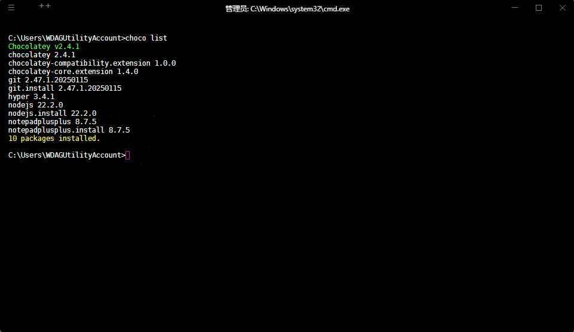
```

:::


* 示例：排除某些软件之后，更新剩下的全部软件

::: code-group

```cmd [cmd 命令]
choco upgrade all --except="'git,notepadplusplus'"
```

```md:img [cmd 控制台]
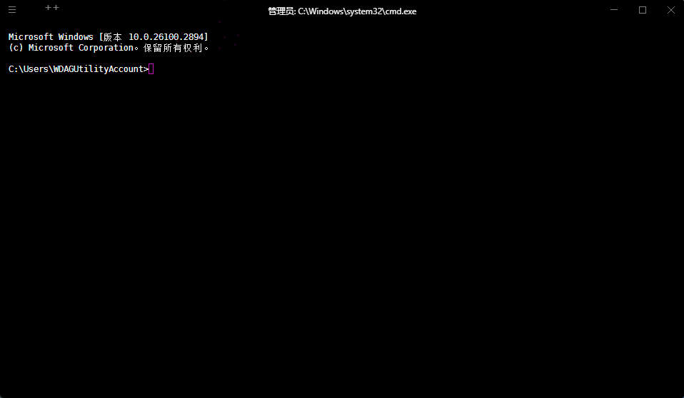
```

:::


* 示例：更新所有软件

::: code-group

```cmd [cmd 命令]
choco upgrade all
```

```md:img [cmd 控制台]
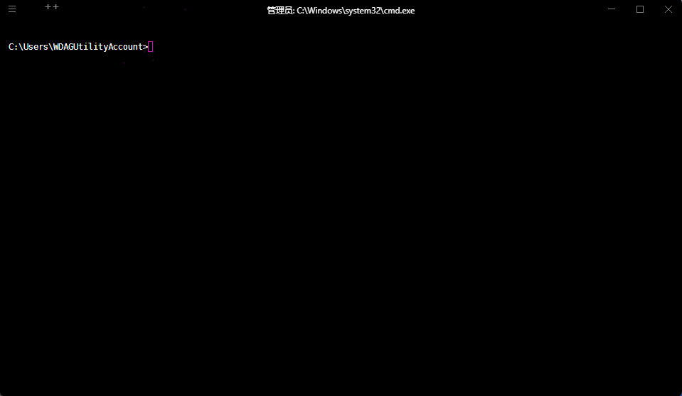
```

:::

### 3.4.4 查询本地已安装的软件

* 命令：

```shell
choco list <软件名> [可选参数]
```

> [!NOTE]
>
> 可选参数：
>
> * `-i、--includeprograms、--include-programs`：显示安装到计算机上的所有软件，包括哪些不是由 Chocolatey  管理的。


* 示例：显示通过 Chocolatey  安装到计算机上的软件

::: code-group

```cmd [cmd 命令]
choco list 
```

```md:img [cmd 控制台]

```

:::


* 示例：显示计算机上的所有软件，包括不是由 Chocolatey  管理的

::: code-group

```cmd [cmd 命令]
choco list -i
```

```md:img [cmd 控制台]
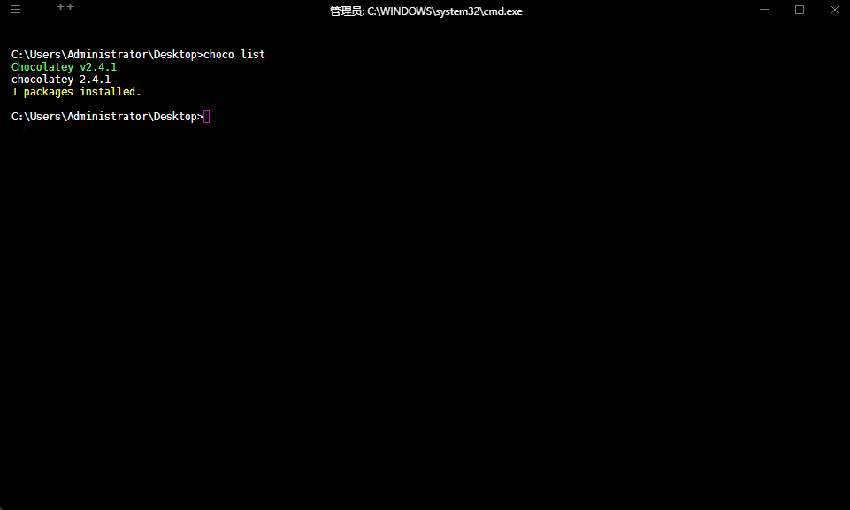
```

:::

### 3.4.5 卸载软件

* 命令：

```shell
choco uninstall <软件名> [可选参数]
```

> [!NOTE]
>
> 可选参数：
>
> * `-f、--force`：强制安装，忽略已安装的相同版本。
> * `-d、--debug`：启用调试模式。
> * `-v、--verbose`：启用详细输出（verbose logging）。
> * `-y, --yes, --confirm`：确认所有提示。
> * `--version`：卸载软件的指定版本。
> * `--all-versions`：卸载软件的所有版本。


* 示例：卸载指定的软件

::: code-group

```cmd [cmd 命令]
choco uninstall git
```

```md:img [cmd 控制台]
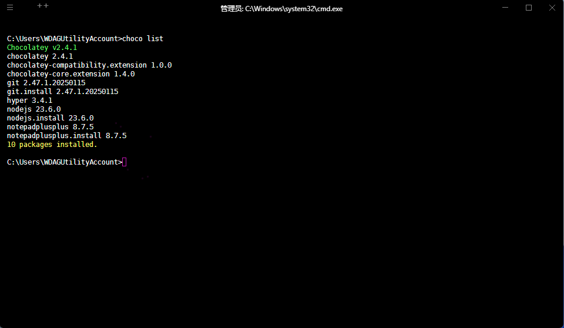
```

:::


* 示例：批量卸载软件

::: code-group

```cmd [cmd 命令]
choco uninstall notepadplusplus googlechrome -dv
```

```md:img [cmd 控制台]
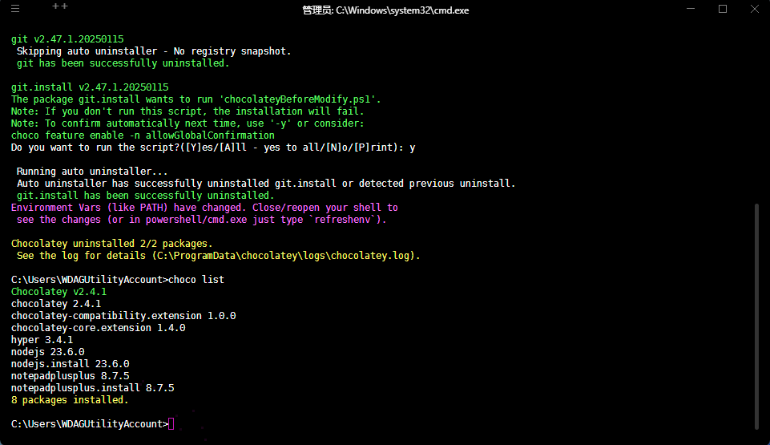
```

:::


* 示例：卸载软件的指定版本

::: code-group

```cmd [cmd 命令]
choco uninstall nodejs --version 23.6.0 -fy
```

```md:img [cmd 控制台]
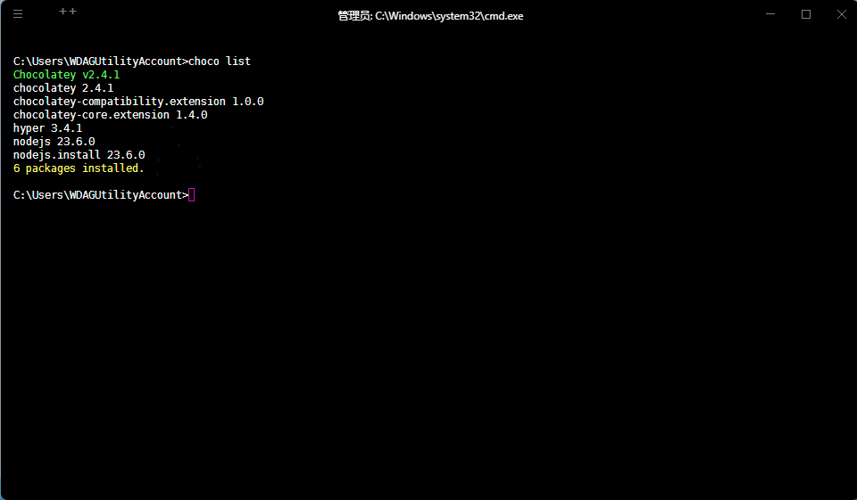
```

:::


* 示例：卸载软件的所有版本

::: code-group

```cmd [cmd 命令]
choco uninstall nodejs --all-versions
```

```md:img [cmd 控制台]
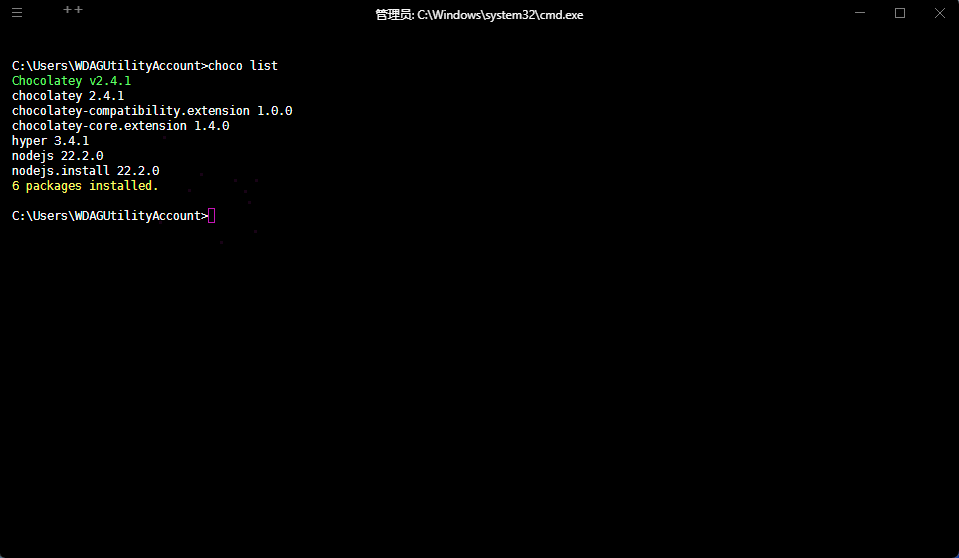
```

:::


# 第四章：包管理器图形化解决方案 --- UniGetUI

## 4.1 概述

* UniGetUI 主要目标是为 Windows 10 和 Windows 11 的最常见 CLI 包管理器创建直观的 GUI，例如：[WinGet](https://learn.microsoft.com/en-us/windows/package-manager/) 、 [Scoop](https://scoop.sh/) 、 [Chocolatey](https://chocolatey.org/) 、 [Pip](https://pypi.org/) 、 [Npm](https://www.npmjs.com/) 、 [.NET Tool](https://learn.microsoft.com/en-us/dotnet/core/tools/dotnet-tool-install) 、 [PowerShell Gallery](https://www.powershellgallery.com/) 等。
* 使用此应用程序，可以轻松下载、安装、更新和卸载在受支持的包管理器上发布的任何软件 。

## 4.2 安装

* 可以通过 winget 等软件包管理器安装：

::: code-group

```cmd [winget]
winget install --exact --id MartiCliment.UniGetUI --source winget
```

```cmd [choco]
choco install wingetui
```

```md:img [cmd 控制台]

```

:::

## 4.3 使用

* 使用方式很简单，就是在图形化界面上操作，如下所示：

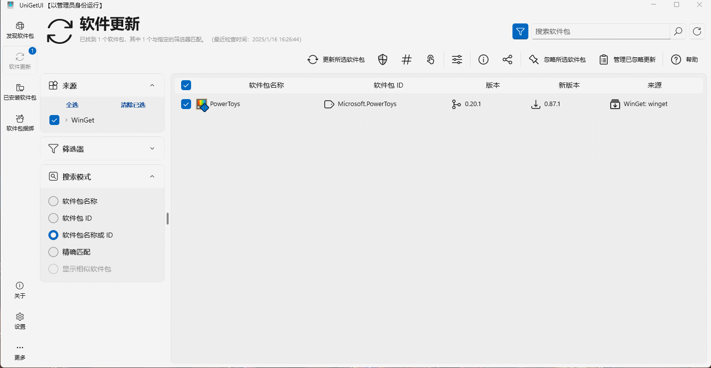
