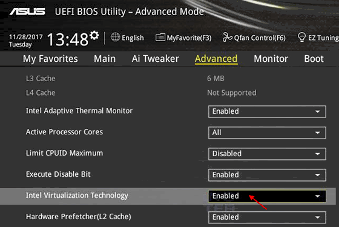
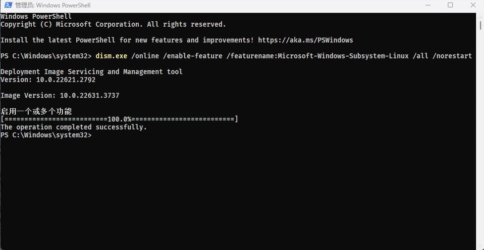
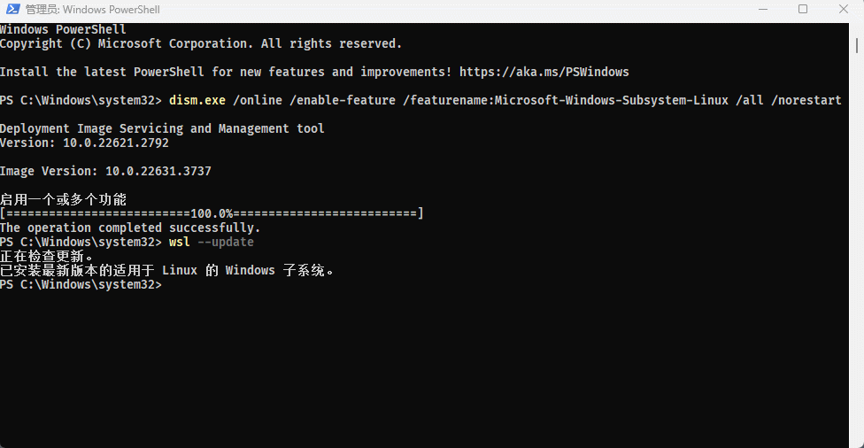
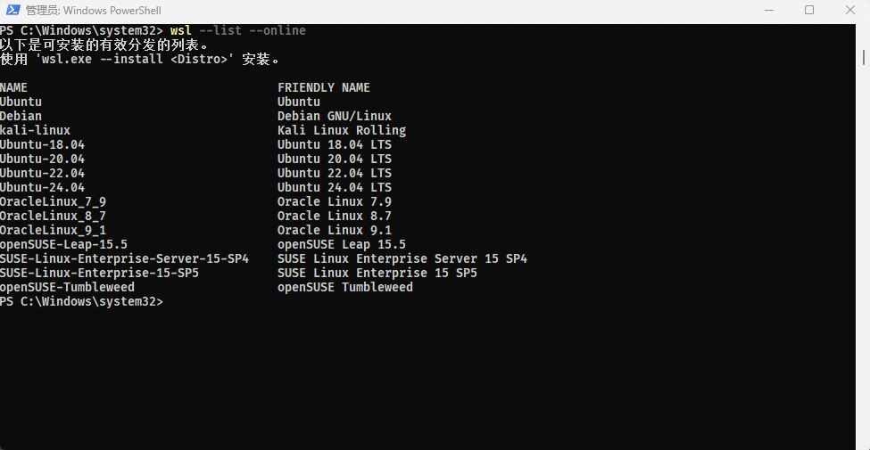
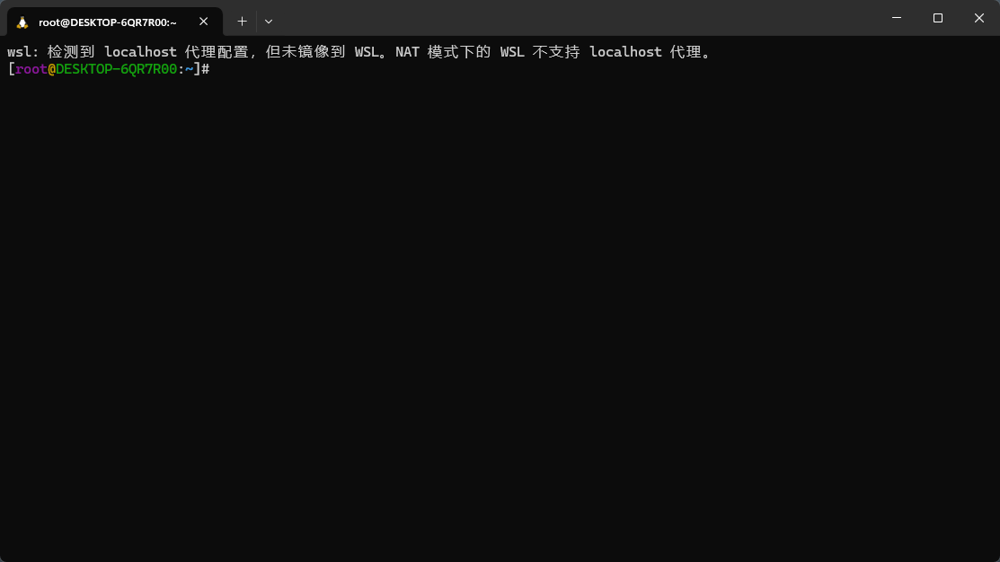

# 第一章：WSL2 是什么？

## 1.1 概述

* WSL2，全称为 Windows Subsystem for Linux 2，是微软提供的一种技术，允许用户在 Windows 操作系统上运行 Linux 内核。WSL2  是 WSL1 的升级版，它引入了一个真正的 Linux 内核来代替 WSL1 中使用的兼容层，从而提供更高的性能和更广泛的系统调用支持。
* 和传统的虚拟化技术的对比，如下所示：


> [!NOTE]
>
> * ① 开启和安装 WSL2 ，需要在 Win10 以上，本人的操作系统是 Win11 。
> * ② 之所以，WSL2 比传统的虚拟化技术，如：VMWare 等，更轻量和高性能，是因为 WSL2 是作用在系统层的，是可以直接调用底层硬件的，而 VMWare  等需要操作系统提供支持。

## 1.2 WSL2 的功能

* ① **真实的 Linux 内核**：WSL2 使用了微软开发的轻量级虚拟机，它包含了一个完整的 Linux 内核。这意味着 WSL2 能够运行更多的 Linux 应用程序，并且支持更多的系统调用。
* ② **文件系统性能提升**：WSL2 的文件系统性能比 WSL1 有显著提升。对于 I/O 密集型的操作，如：编译代码或数据库操作，WSL2 能够提供更快的速度。
* ③ **兼容性增强**：由于使用了真实的 Linux 内核，WSL2 对 Linux 应用程序的兼容性大幅提高。许多在 WSL1 上不能运行或需要调整的应用程序，可以在 WSL2 上直接运行。
* ④ **网络功能改进**：WSL2 提供了更好的网络集成，能够更容易地与 Windows 上的其他网络资源进行交互。
* ⑤ **资源使用优化**：WSL2 使用轻量级虚拟机，比传统的虚拟机占用更少的资源，同时提供了类似的隔离和安全性。

## 1.3 WSL2 的用途

* ① **开发环境**：WSL2 为开发者提供了一个原生的 Linux 开发环境，而无需离开 Windows 。这对于需要在 Linux 上开发、测试或运行应用程序的开发者非常有帮助。
* ② **学习和实验**：用户可以使用 WSL2 在 Windows 上学习和实验 Linux 命令行工具和应用程序，而无需设置双重引导系统或安装虚拟机。
* ③ **多平台开发**：对于跨平台开发者来说，WSL2 允许他们在一个操作系统上同时进行 Windows 和 Linux 平台的开发和测试，提高工作效率。
* ④ **运行 Linux 工具和应用程序**：WSL2 支持在 Windows 上直接运行各种 Linux 工具和应用程序，如：Docker、数据库、编程语言环境等。


# 第二章：WSL2 的安装和配置

## 2.1 WSL2 的安装

* ① BIOS 或 UEFI 中，开启虚拟化：步骤略。



* ② 查看是否开启了虚拟化：


* ③ 启用适用于 Linux 的 Windows 子系统：

> [!IMPORTANT]
>
> 以管理员身份打开 PowerShell 并运行，执行完上述命令之后，如果提示需要重启计算机，那就重启计算机！！！

::: code-group

```powershell [powershell 命令]
dism.exe /online /enable-feature /featurename:Microsoft-Windows-Subsystem-Linux /all /norestart
```

```md:img [cmd 控制台]

```

:::

* ④ 启用虚拟机功能：

> [!IMPORTANT]
>
> 以管理员身份打开 PowerShell 并运行，执行完上述命令之后，如果提示需要重启计算机，那就重启计算机！！！

::: code-group

```powershell [powershell 命令]
dism.exe /online /enable-feature /featurename:VirtualMachinePlatform /all /norestart
```

```md:img [cmd 控制台]

```

:::

* ⑤ 更新 Linux 内核包：

> [!IMPORTANT]
>
> wsl2 的最新 Linux 内核包托管在 GitHub 上，某些国家可能会污染 Github 相关的域名，那么就需要手动下载，然后安装即可，下载地址在[这里](https://wslstorestorage.blob.core.windows.net/wslblob/wsl_update_x64.msi)。

::: code-group

```powershell [powershell 命令]
wsl --update
```

```md:img [cmd 控制台]

```

:::

* ⑥ 将 wsl2 设置为默认版本：

::: code-group

```powershell [powershell 命令]
wsl --set-default-version 2
```

```md:img [cmd 控制台]

```

:::

* ⑦ 查看官方在线支持的 Linux 版本：

::: code-group

```powershell [powershell 命令]
wsl --list --online
```

```md:img [cmd 控制台]

```

:::

* ⑧ 安装指定版本的 Linux ：

> [!IMPORTANT]
>
> 官方支持的 Linux 版本，托管在 Github 上，某些国家可能会污染 Github 的域名；此时，要么使用`科学上网`，要么在 `Microsoft Store` 中搜索并安装。

::: code-group

```powershell [powershell 命令]
wsl --install Ubuntu-24.04
```

```md:img [cmd 控制台]

```

:::

* ⑨ 在 Microsoft Store 中搜索并安装（可选）：


* ⑩ 查询本地安装的 Linux 版本：

::: code-group

```powershell [powershell 命令]
wsl --list
```

```md:img [cmd 控制台]

```

:::

## 2.2 WSL2 解决代理问题

* 在安装和配置 WSL2 之后，可能会出现如下的提示，即：



* 那么，只需要修改 `%USERPROFILE%\.wslconfig`文件，内容如下：

::: code-group

```txt [.wslconfig]
[wsl2]
networkingMode=mirrored
dnsTunneling=true
firewall=true
autoProxy=true

[experimental]
# requires dnsTunneling but are also OPTIONAL
bestEffortDnsParsing=true
useWindowsDnsCache=true
```

```md:img [cmd 控制台]

```

:::

* 在命令行中，执行如下的命令：

::: code-group

```cmd [cmd 命令]
wsl --shutdown
```

```md:img [cmd 控制台]

```

:::

* 此时，再打开终端，就没有这种提示了：


## 2.3 WSL2 启用 systemd

### 2.3.1 概述

* 根据 [systemd.io](https://systemd.io/)：“systemd 是 Linux 系统的基本构建基块套件。 它提供一个系统和服务管理器，该管理器作为 PID 1 运行并启动系统的其余部分。”
* Systemd 主要是一个 init 系统和服务管理器，它包括按需启动守护程序、装载和自动装载点维护、快照支持以及使用 Linux 控制组进行跟踪等功能。
* 大多数主要的 Linux 发行版现在都运行 systemd，因此在 WSL2 上启用它可使体验更接近于使用裸机 Linux。

> [!NOTE]
>
> * ① 默认情况下，在 WSL2 中，只有 Ubuntu 才会将 systemd 作为 pid-1 的守护进程（微软维护和定制的 Ubuntu 版本，在 GitHub 的 Codespace 中默认的 Linux 环境就是 Ubuntu）。但是，基于 WSL2 为内核的其余 Linux 发行版本并非将 systemd 作为 pid-1 的守护进程。
> * ② 本次以 AlmaLinux9 作为演示！！！

* 检查进程树，判断 systemd 是否正在运行：

::: code-group

```bash [bash 命令]
ps -p 1 -o comm= # 如果显示 systemd ，则表示 systemd 正在运行
```

```md:img [cmd 控制台]

```

:::

### 2.3.2 操作步骤

* ① 查询 WSL2 的版本，确保 WSL2 的版本为 `0.67.6` 或更高版本：

::: code-group

```cmd [cmd 命令]
# 如果未满足要求，则使用 wsl --update 更新 WSL2 版本
wsl --version # 在 win 中的 cmd 或 PowerShell 执行该命令
```

```md:img [cmd 控制台]

```

:::


* ② 向 `/etc/wsl.conf` 配置文件中写入以下内容：

::: code-group

```bash [bash 命令]
cat <<EOF | tee /etc/wsl.conf 
[boot]
systemd=true
EOF
```

```md:img [cmd 控制台]

```

:::


* ③ 重启 WSL 实例：

::: code-group

```cmd [cmd 命令]
# 如果未满足要求，则使用 wsl --update 更新 WSL2 版本
wsl --shutdown # 在 win 中的 cmd 或 PowerShell 执行该命令
```

```md:img [cmd 控制台]

```

:::


* ④ 查看是否启用成功：

::: code-group

```bash [bash 命令]
ps -p 1 -o comm=
```

```md:img [cmd 控制台]

```

:::