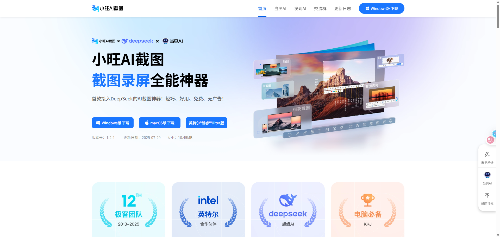
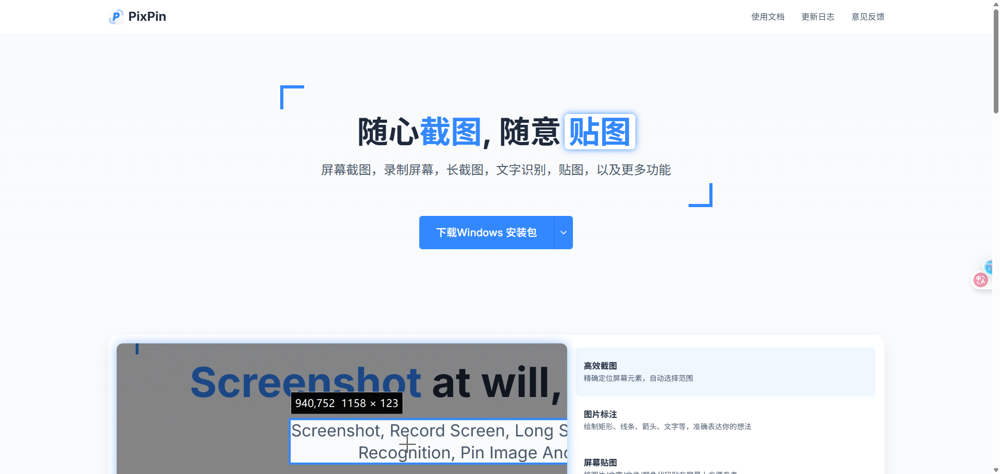

# 第一章：截图工具

## 1.1 小旺 AI 截图

* [小旺 AI 截图](https://www.xiaowang.com/) 是一款轻量级的 AI 截图工具，支持截图、录屏、GIF 生成，并接入了 DeepSeek AI，适合追求简洁和 AI 功能的用户。

## 1.2 Pixpin

* [PixPin](https://pixpin.cn/) 的名字来源于“Pixel Pin”，简单来说是一个截图、贴图的工具，但是 PixPin 以截图和贴图两大功能为核心做了大量的优化功能，目标是提升用户在工作时的工作效率，无论用户使用电脑做何种工作，都可以使用 PixPin 提高工作效率。

